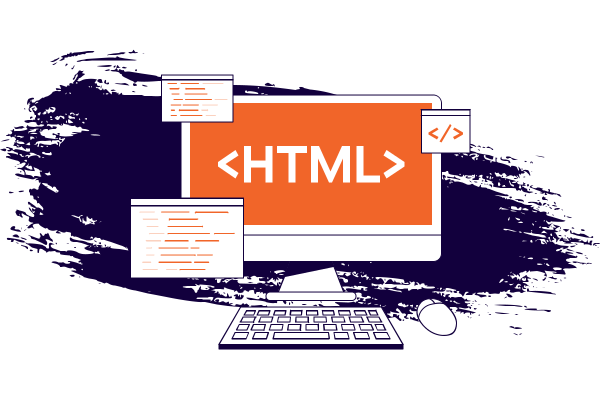

# Introduction to HTML


 

## What is HTML? Think of it as Building a House

Imagine you're building a house. You start with a basic structure: walls, a roof, and floors. HTML is like that structure for a webpage. It's the skeleton that gives your page shape.

HTML stands for HyperText Markup Language. It's a set of rules for structuring content on the web. Think of it as the blueprint for your digital house.


## A Brief History of HTML

HTML, or HyperText Markup Language, was born out of the need to share information easily across computers. Its creator, Tim Berners-Lee, envisioned a web where documents could be linked together, forming a vast interconnected network.   

The first version of HTML was released in 1993. It was incredibly basic, with only a handful of tags to structure text.


## Evolution of HTML

Over the years, HTML has evolved significantly to meet the growing demands of the web. Here's a brief overview:   

HTML 2.0: Introduced more tags for formatting text, images, and links.
HTML 3.2: Added support for tables, forms, and other interactive elements.   
HTML 4.01: Became the most widely used version, incorporating almost all common HTML elements.   
XHTML: A stricter version of HTML based on XML syntax, though less popular.   
HTML5: The current standard, offering a vast array of new features like multimedia, local storage, and semantic elements.   


## Why Learn HTML?

**Create Your Own Websites:** From personal blogs to online stores, HTML is the foundation.  
**Understand How Websites Work:**  a solid base to understand other web technologies like CSS and JavaScript.  
**Boost Your Career:** Many tech jobs require at least a basic understanding of HTML.  

```html filename="example.html" {3}  copy

    h1>Hello world</h1>

```
