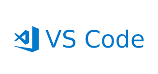

# INSTALLING A CODE EDITOR
 
 

 
 
 
A code editor allows you to write and run your code.

For this lesson visual studio code is recommended as it is easier to set up and has a lot of tools for making programming easier.
Installing a code editor like Visual Studio Code is a straightforward process. Here's how to do it for Windows or Mac its basically the same thing:

### Downloading Visual Studio Code:
1.	Head over to the official Visual Studio Code download page: https://code.visualstudio.com/download
2.	You'll see different buttons for different. Click on the one for your OS to download the installer file.

### Running the Installer:
1.	Once the download is complete, locate the downloaded file. It will likely be named something like "VSCodeUserSetup-x64.exe" (the exact name may vary slightly depending on the version).
2.	Double-click the downloaded file to launch the installer.

### Installation Process:
1.	The installer will walk you through the setup process. You'll typically see options like:
o	License Agreement: You'll need to agree to the license terms to proceed.
o	Start Menu Folder: You can choose to create a Start Menu folder for VS Code or skip this step.
o	Desktop Shortcut: You can decide if you want a shortcut icon for VS Code on your desktop.
o	Additional Components: You can choose to install optional components during setup, but the defaults are usually fine for beginners.
2.	Once you've reviewed the options, click the "Install" button. The installer will unpack the necessary files and configure VS Code on your system.

### Launching VS Code:

1.	After successful installation, the option to launch VScode might be presented. You can also find it from your Start Menu or by double-clicking the VS Code application file in the installation directory.
Congratulations! You should now have Visual Studio Code up and running on your machine.

 

#### Additional Tips:
•	Make sure you have an internet connection during installation, as VS Code might download some additional components during the process.
•	You can customize the look and feel of VS Code with themes and extensions available in the VS Code Marketplace.
•	There are plenty of resources and tutorials available online to help you learn more about Visual Studio Code and its features.
